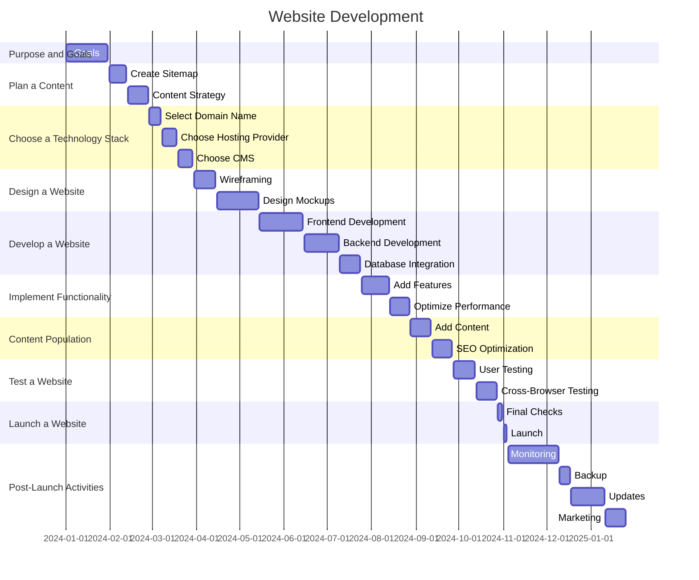

```mermaid
gantt
    title Website Development

    dateFormat  YYYY-MM-DD
    axisFormat  %Y-%m-%d

    section Purpose and Goals
    Goals : 2024-01-01, 2024-01-30

    section Plan a Content
    Create Sitemap : 2024-01-31, 2024-02-12
    Content Strategy : 2024-02-13, 2024-02-27

    section Choose a Technology Stack
    Select Domain Name : 2024-02-28, 2024-03-07
    Choose Hosting Provider : 2024-03-08, 2024-03-18
    Choose CMS : 2024-03-19, 2024-03-29

    section Design a Website
    Wireframing : 2024-03-30, 2024-04-14
    Design Mockups : 2024-04-15, 2024-05-14

    section Develop a Website
    Frontend Development : 2024-05-15, 2024-06-14
    Backend Development : 2024-06-15, 2024-07-09
    Database Integration : 2024-07-10, 2024-07-24

    section Implement Functionality
    Add Features : 2024-07-25, 2024-08-13
    Optimize Performance : 2024-08-14, 2024-08-27

    section Content Population
    Add Content : 2024-08-28, 2024-09-11
    SEO Optimization : 2024-09-12, 2024-09-26

    section Test a Website
    User Testing : 2024-09-27, 2024-10-12
    Cross-Browser Testing : 2024-10-13, 2024-10-27

    section Launch a Website
    Final Checks : 2024-10-28, 2024-10-31
    Launch : 2024-11-01, 2024-11-03

    section Post-Launch Activities
    Monitoring : 2024-11-04, 2024-12-09
    Backup : 2024-12-10, 2024-12-17
    Updates : 2024-12-18, 2025-01-10
    Marketing : 2025-01-11, 2025-01-25
```
